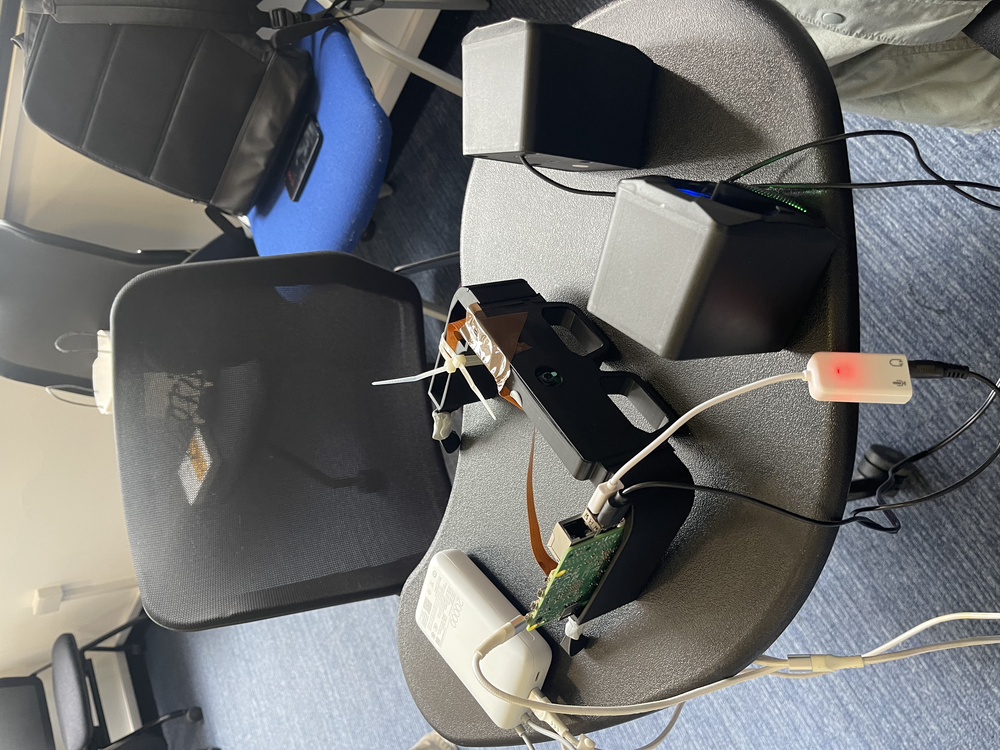
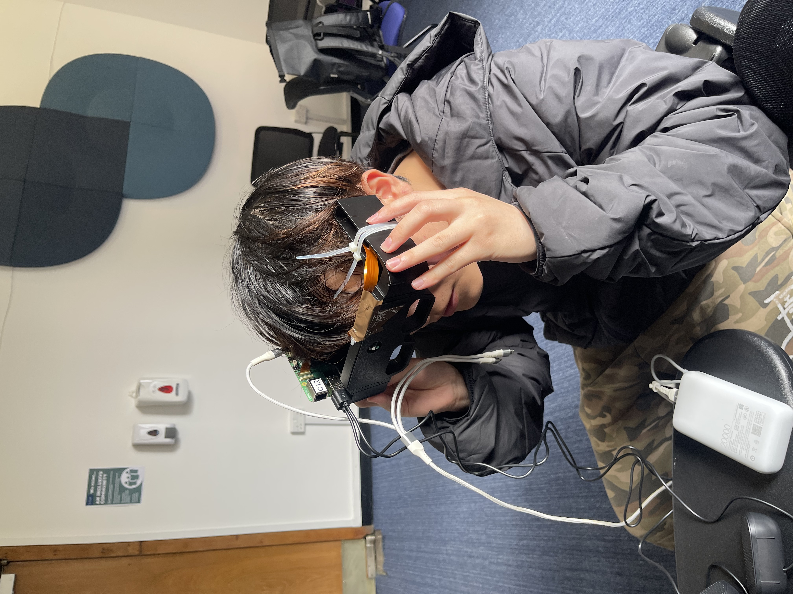

# SignSpeak Glasses — Real-Time Sign Language Translator

A real-time embedded system running on Raspberry Pi that recognises American
Sign Language (ASL) hand gestures (A–Z) from a camera and speaks the detected
letter aloud via a text-to-speech engine.

## 📸 Physical Prototype & System Integration

**[General Design Vision]**
The SignSpeak Glasses prototype is the result of rigorous hardware-software co-design. It leverages a custom 3D-printed chassis to transform a Raspberry Pi-based system into a functional, wearable assistive device designed for real-time sign language recognition.

<div align="center">
  <table border="0">
    <tr>
      <td align="center" width="50%" style="border: none;">
        <div style="box-shadow: 0 4px 12px rgba(0,0,0,0.15); border-radius: 12px; overflow: hidden; margin: 10px;">
          
        </div>
        <br/>
        <b>[Specific] System Components</b><br/>
        <small>Featuring the Raspberry Pi core, a high-capacity power module, and an integrated audio diffusion system.</small>
      </td>
      <td align="center" width="50%" style="border: none;">
        <div style="box-shadow: 0 4px 12px rgba(0,0,0,0.15); border-radius: 12px; overflow: hidden; margin: 10px;">
          
        </div>
        <br/>
        <b>[Specific] Ergonomic Form Factor</b><br/>
        <small>Demonstrating the head-mounted interface designed to align the camera with the user's natural field of view.</small>
      </td>
    </tr>
  </table>
</div>


**Architecture:** libcamera hardware event → blocking-I/O callback (producer
thread) → `condition_variable` wakes consumer thread → YCrCb skin segmentation
→ bounding-box-normalised inference (**TinyCNN via ONNX / OpenCV DNN** when
`gesture_cnn.onnx` is present, otherwise **KNN** from `knn_model.xml`) → espeak-ng
TTS.

Social media: <https://www.instagram.com/signspeakglasses/>

Short demonstration of the live pipeline:

[Watch the video](https://youtube.com/shorts/Hi0u0ZBQyyE?feature=share)

- More details about the process, progress, and final product demonstrations can be found on social media.
### 👥 Team & Division of Labour
<details>
<summary><b>Click to view detailed team roles</b></summary>

| Team Member | Core Role | Specific Tasks & Contributions |
| :--- | :--- | :--- |
| **JINF XING** | C++ Software Architect | Implementation of SOLID principles, OOP class structure design, failsafe memory management |
| **NING LIU** | Computer Vision Engineer | Raspberry Pi Camera (CSI / libcamera) interfacing, OpenCV real-time frame acquisition, image processing algorithms |
| **ZHENDONG GU** | Lead Hardware Designer | 3D CAD modeling, 3D printing, physical enclosure assembly, thermal stress testing |
</details>
---

## Hardware Requirements

- Raspberry Pi 4 / 5 running **Debian Trixie** (64-bit)
- Raspberry Pi Camera Module v2 (IMX219) connected via CSI ribbon cable
- USB sound card + speaker (for audio output)

## Hardware 3D printing

The custom hardware chassis for this project was built from scratch.

3D Modeling: Autodesk Fusion 360

3D Printer: Bambu Lab P1S

Material: Standard PLA (1.75mm)


---

## 1. Install System Dependencies

Run the following on your Raspberry Pi (fresh Debian Trixie image):

```bash
sudo apt update
sudo apt install -y \
    build-essential \
    cmake \
    pkgconf \
    libopencv-dev \
    libcamera-dev \
    espeak-ng \
    alsa-utils
```

> `pkgconf` is required so that CMake can locate libcamera via `pkg-config`.
> `alsa-utils` provides `aplay` for WAV playback (USB audio).

---

## 2. Build and Install the libcamera2opencv Wrapper

This project uses [libcamera2opencv](https://github.com/berndporr/libcamera2opencv)
— a thin wrapper that delivers libcamera frames via a C++ virtual-function
callback, providing the hardware-event-driven, blocking-I/O wakeup pattern
required by this course.

```bash
git clone https://github.com/berndporr/libcamera2opencv.git
cd libcamera2opencv
cmake .
make -j4
sudo make install
sudo ldconfig
cd ..
```

---

## 3. Clone This Repository

```bash
git clone https://github.com/ning021717/ENG5220-Real-Time-Embedded-Programming.git
cd ENG5220-Real-Time-Embedded-Programming
```

---

## 4. Build the Project

```bash
mkdir -p build
cd build
cmake ..
make -j4
cd ..
```

All binaries are placed inside `build/`. **Run them from the project root**
so that `gesture_cnn.onnx` and/or `knn_model.xml` are found on the default path.

---

## 5. Models (inference)

| File | Role |
|------|------|
| `gesture_cnn.onnx` | **Preferred.** Tiny CNN (OpenCV `dnn`), shipped in the repo. |
| `knn_model.xml` | **Fallback** if ONNX is absent. Generate locally with `TrainApp` after collecting data under `dataset/`. |

`MainApp` chooses `gesture_cnn.onnx` when it exists; otherwise it loads `knn_model.xml`.

Training images under `dataset/` are **not** version-controlled (too large). The
KNN XML is also omitted from git; use the ONNX model for a one-step clone-and-run
experience.

---

## 6. Run

### Step 1 — Data collection (optional)

Only needed if you want to **retrain** KNN or expand letters yourself.

```bash
./build/CaptureImages
```

Enter the letter (A–Z) when prompted. Adjust the **YCrCb** trackbars (**Cr Min/Max**,
**Cb Min/Max**) until the hand appears white and the background black, then press
`s` to save frames and `q` to quit. Images are saved to `dataset/<LETTER>/`.

### Step 2 — Train KNN (optional)

Requires a populated `dataset/` tree.

```bash
./build/TrainApp
```

Writes `knn_model.xml` to the project root. Use this path if you cannot use the
default ONNX model.

### Step 3 — Real-time inference

```bash
./build/MainApp
```

Shows two windows (live ROI + binary mask). The main window title includes the
active backend (`CNN` or `KNN`). Hold a hand gesture inside the blue rectangle;
after **6** stable frames the detected letter is spoken aloud. Press **ESC** or
**Ctrl+C** to exit cleanly.

### Audio device (USB sound card)

Playback uses `aplay` with ALSA device `plughw:2,0` by default. If your USB card
uses another index, set before launch:

```bash
export SLT_ALSA_DEVICE="plughw:1,0"
./build/MainApp
```

---

## 7. Run the Unit Tests

```bash
cd build
ctest --output-on-failure -V
```

`GestureRecognizerUnitTests` runs **without** a camera. If `gesture_cnn.onnx` is
in the repository root, CI exercises the CNN path; if you add `knn_model.xml`
locally, the KNN path is tested too. At least one model file must be present or
the test executable reports failure (so empty checkouts are caught).

---

## Project structure

```
.
├── main.cpp                        # Consumer thread, GUI, signalfd shutdown
├── capture_images.cpp              # libcamera callback → normalised binary-mask collector
├── train.cpp                       # KNN training from dataset/ (bbox-normalised features)
├── augment_dataset.cpp             # Offline dataset augmentation (C++)
├── CameraManager.cpp/.hpp          # libcam2opencv wrapper, ROI extraction
├── GestureRecognizer.cpp/.hpp      # YCrCb segmentation + KNN or ONNX-CNN inference
├── VoiceSynthesizer.cpp/.hpp       # espeak-ng / aplay TTS background thread
├── GestureRecognizerUnitTests.cpp  # Unit tests (CI)
├── gesture_cnn.onnx                # Default TinyCNN weights (OpenCV DNN)
├── knn_model.xml                   # Optional; generate with TrainApp (not in git)
├── fix_cam.sh                      # Camera reset helper (run if the sensor hangs)
├── CMakeLists.txt
├── LICENSE
└── README.md
```

---

## Design highlights

| Principle | Implementation |
|-----------|-----------------|
| Blocking I/O wakes threads | libcamera kernel event → callback wakes consumer via `condition_variable` |
| No polling / no `sleep()` | Producer blocks in libcamera's `poll()`; shutdown via `signalfd` + `read()` |
| C++ virtual-function callbacks | `CameraManager` inherits `Libcam2OpenCV::Callback`; `VoiceSynthesizer` uses `condition_variable` |
| OOP encapsulation | `CameraManager`, `GestureRecognizer`, `VoiceSynthesizer` — each owns its state |
| cmake + CTest | Multiple targets; CI builds and runs unit tests on every push |

---

## SOLID design rationale

| Principle | How it is applied |
|-----------|------------------|
| **Single Responsibility** | Each class has one reason to change: `CameraManager` — libcamera I/O and ROI; `GestureRecognizer` — segmentation and ML inference; `VoiceSynthesizer` — TTS. `main.cpp` only wires components. |
| **Open / Closed** | `GestureRecognizer::predict(roi, outMask)` is stable; backends (KNN XML vs ONNX) are selected by filename without changing callers. |
| **Liskov Substitution** | `CameraManager` implements `Libcam2OpenCV::Callback`; frames are delivered through the base interface. |
| **Interface Segregation** | Minimal public APIs; trackbar-bound YCrCb thresholds are the only extra surface for GUI tuning. |
| **Dependency Inversion** | `main` depends on a model path string and `FrameCallback`, not on libcamera internals. |

> **Trade-off:** `CR_MIN/MAX`, `CB_MIN/MAX` are public because OpenCV `createTrackbar()` requires `int*`. Internal state (`knn`, `cnnNet`, `IMG_SIZE`) stays private.

---

## Real-time latency analysis

| Stage | Estimated latency (Pi 4 class) | Notes |
|-------|-------------------------------|--------|
| libcamera frame period | 33 ms @ 30 fps | Hardware bound |
| DMA → user callback | < 1 ms | Blocking `poll()` |
| `condition_variable` wake | < 0.1 ms | No busy-wait |
| YCrCb + morphology (~440×380) | ~3–6 ms | Shared by both backends |
| **CNN** forward (50×50, ONNX) | ~4–10 ms | Fixed cost; `opencv_dnn` CPU backend |
| **KNN** `findNearest` | ~2–8 ms + O(N samples) | Grows with training set size |
| Debounce (6 frames) | ~200 ms | Suppresses single-frame errors |
| `aplay` pre-generated WAV | ~100 ms + audio | Avoids cold `espeak-ng` per letter |

End-to-end perception latency (excluding debounce) stays on the order of **one frame** for vision + inference — suitable for interactive signing.

---

## Milestones

### Milestone 1 — 2026-02-11 (Hardware & pipeline)
- Camera Module v2 validated with libcamera
- Initial threaded capture and gesture loop

### Milestone 2 — 2026-02-18 (Closed-loop CV)
- Skin segmentation (evolved to YCrCb) + KNN end-to-end
- Data-collection tool; initial letters

### Milestone 3 — 2026-02-24 (Dataset growth)
- Expanded toward full A–Z coverage
- Repository synchronised with remote

### Milestone 4 — 2026-04-19 (Deterministic RT architecture)
- libcamera + blocking I/O; `signalfd` shutdown
- `CameraManager` as `Libcam2OpenCV::Callback`
- Optional ONNX CNN path for improved accuracy

---

## Acknowledgements

Real-time camera capture is built on **[libcamera2opencv](https://github.com/berndporr/libcamera2opencv)** by [Bernd Porr](https://github.com/berndporr) — the libcamera → OpenCV callback wrapper used in this course. We are grateful for this library and the ENG5220 teaching materials that describe the event-driven, blocking-I/O pattern it enables.

---

License: see `LICENSE` (MIT).
